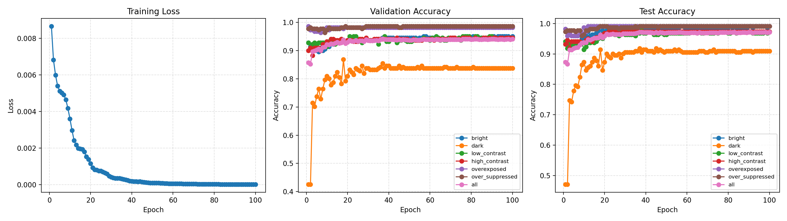
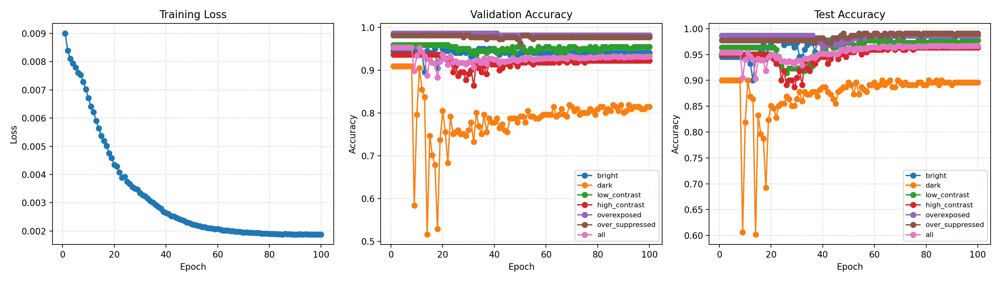

# Image-Quality-Assessment-Made-Practical-for-Smartphone-Photography

[](LICENSE)
[](https://www.python.org/downloads/)
[](https://pytorch.org/)


> A practical No-Reference Image Quality Assessment (NR-IQA) method specifically designed for modern smartphone photography challenges. Trained on real-world smartphone images with subjective labels.

## Introduction

We establish the relationships among quality labels by constructing a HEX graph informed by prior knowledge. Based on this framework, we propose a probabilistic multi-label ordinal regression model formulated as a conditional random field (CRF).

## Project Progress Tracker

### v1. CLIP visual encoder + FC

- Constructed a 6-label HEX graph for initial validation

```
Labels = [ "整体偏亮", "整体偏暗", "整体对比度高", "整体对比度低", "高光过曝", "高光压制过度"]
Levels = { "1": "不存在相应问题", "2": "普通", "3": "严重", "4": "阻塞"}
Nodes = [
    {"label":"整体偏亮","levels":[1,2,3,4]},
    {"label":"整体偏暗","levels":[1,2,3,4]},
    {"label":"整体对比度高","levels":[1,2,3,4]},
    {"label":"整体对比度低","levels":[1,2,3,4]},
    {"label":"高光过曝","levels":[1,2,3,4]},
    {"label":"高光压制过度","levels":[1,2,3,4]}
  ]
Exclusions = [
		# undirected edges
    {"label_a":"整体偏亮","a_levels":[2,3,4], "label_b":"整体偏暗","b_levels":[2,3,4]},
    {"label_a":"整体对比度高","a_levels":[2,3,4], "label_b":"整体对比度低","b_levels":[2,3,4]},
    {"label_a":"高光过曝","a_levels":[2,3,4], "label_b":"高光压制过度","b_levels":[2,3,4]}
]
Subsumptions = [
		# directed edges
    {"label_a":"整体偏亮", "label_b":"整体偏亮", "map":[[3,2],[4,2],[4,3]]},
    {"label_a":"整体偏暗", "label_b":"整体偏暗", "map":[[3,2],[4,2],[4,3]]},
    {"label_a":"整体对比度高", "label_b":"整体对比度高", "map":[[3,2],[4,2],[4,3]]},
    {"label_a":"整体对比度低", "label_b":"整体对比度低", "map":[[3,2],[4,2],[4,3]]},
    {"label_a":"高光过曝", "label_b":"高光过曝", "map":[[3,2],[4,2],[4,3]]},
    {"label_a":"高光压制过度", "label_b":"高光压制过度", "map":[[3,2],[4,2],[4,3]]}
]
```

- Prepared data with the six labels

| Dataset    | Total | Has Issue | No Issue | bright | dark | low_contrast | high_contrast | overexposed | over_suppressed |
| ---------- | ----- | --------- | -------- | ------ | ---- | ------------ | ------------- | ----------- | --------------- |
| Overall    | 1471  | 400       | 1071     | 78     | 146  | 53           | 73            | 21          | 34              |
| Train      | 1029  | 282       | 747      | 51     | 104  | 40           | 51            | 17          | 23              |
| Validation | 222   | 61        | 160      | 12     | 20   | 9            | 14            | 3           | 4               |
| Test       | 221   | 60        | 161      | 12     | 22   | 8            | 11            | 3           | 5               |

- Implemented code

  - CLIP image encoder

  - HEX graph probability

  - Focal loss

- Accuracy report

| Label    | bright  | dark   | low_contrast | high_contrast | overexposed | over_suppressed | total  |
| -------- | ------- | ------ | ------------ | ------------- | ----------- | --------------- | ------ |
| Accuracy | 0.93212 | 0.8461 | 0.9457       | 0.9321        | 0.9909      | 0.9773          | 0.9660 |

The specific prediction results on the test set and validation set have been uploaded to the "output/oppo_test_99.csv" file, which includes both the predicted results and the true labels.



### v2. CLIP + CoOp

- Implementation files

  - model.py

  - train_v2.py

- Accuracy report

  | Label    | bright | dark   | low_contrast | high_contrast | overexposed | over_suppressed | total  |
  | -------- | ------ | ------ | ------------ | ------------- | ----------- | --------------- | ------ |
  | Accuracy | 0.9864 | 0.8959 | 0.9773       | 0.9638        | 0.9864      | 0.9909          | 0.9668 |



